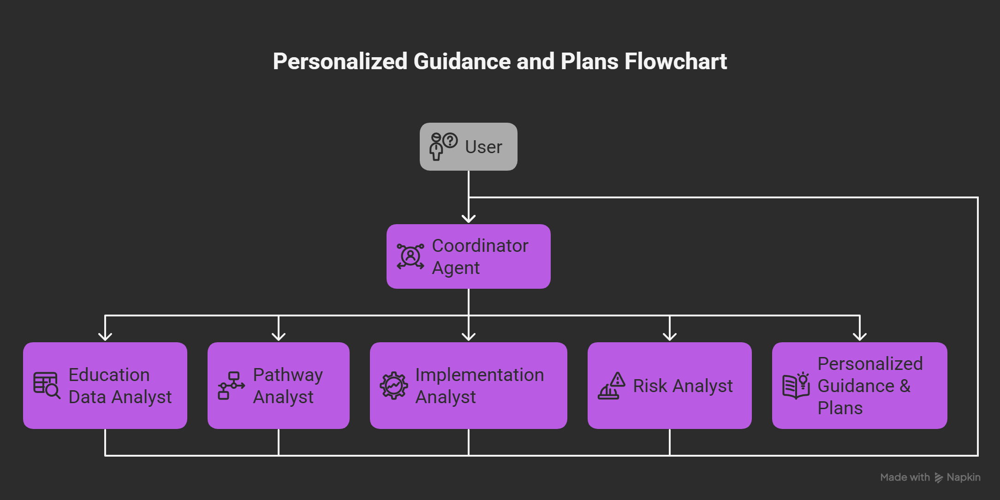
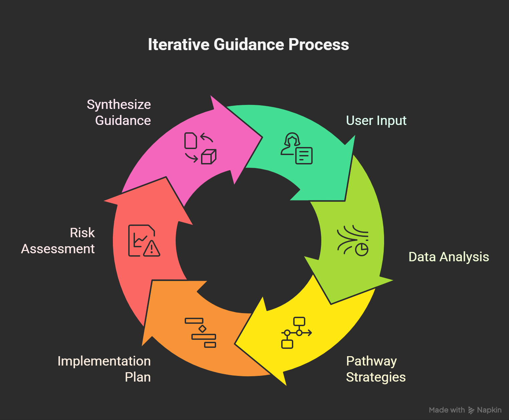

# 🎓 Education Path Advisor for India

> **Empowering Indian students and parents to make smarter education and career decisions!**

---

## 🚦 What is this?

**Education Path Advisor** is your AI-powered guide to India's complex education system. Whether you're a student, parent, or counselor, this tool helps you:

- Discover the best entrance exams and colleges for your goals
- Get step-by-step plans for exam prep, applications, and documentation
- Understand reservation policies and state-specific requirements
- Assess risks and always have a backup plan

No more confusion—just clear, actionable advice tailored to your unique situation!

---

## 🗺️ System Architecture (Mermaid Diagram)



---

## 🧩 Agent Workflow (Mermaid Sequence Diagram)



---

## ✨ Why You'll Love It

- **Personalized Pathways:** Recommendations based on your interests, aptitude, timeline, location, and reservation category.
- **Covers All Major Exams:** JEE, NEET, CUET, state CETs, and more.
- **Stepwise Action Plans:** Never miss a deadline or document.
- **Risk & Backup Analysis:** Know your options if things don't go as planned.
- **Region & Language Aware:** Considers vernacular preferences, state quotas, and local institutions.
- **Privacy First:** No personal data stored—your queries are safe.

---

## 🧠 How It Works (Agent Prompts)

### 1. Education Data Analyst

- **Role:** Generates a comprehensive, source-based educational landscape analysis for a chosen field in India using only Google Search.
- **Output:** `education_data_analysis_output` — A structured report covering institutions, entrance exams, reservation, career prospects, alternative pathways, and key sources.

### 2. Pathway Analyst

- **Role:** Develops at least five distinct, actionable pathway strategies based on your aptitude, timeline, location, and the data analyst’s report.
- **Output:** `proposed_pathway_strategies_output` — Each strategy details target institutions, exams, costs, career outcomes, and a comparative analysis.

### 3. Implementation Analyst

- **Role:** Creates a detailed, stepwise implementation plan for your selected pathway, including preparation, documentation, financial planning, logistics, and milestones.
- **Output:** `implementation_plan_output` — A plan tailored to Indian realities, with timelines, resources, and contingency routes.

### 4. Risk Analyst

- **Role:** Evaluates academic, financial, institutional, career, geographic, and psychological risks for your chosen pathway and plan, and proposes mitigation strategies.
- **Output:** `final_risk_assessment_output` — A comprehensive risk report with actionable advice and alignment summary.

---

## 🖥️ Example Interactions

### 1. Engineering Aspirant

**User:** I’m in 12th grade, interested in engineering. I want to get into a top college.
**Agent:** Collects education_interest, analyzes and summarizes top exams, eligibility, and college pathways. Then, generates 5 pathway strategies (IIT, NIT, state colleges, private, diploma routes), and provides a timeline-aligned plan and risk report.

### 2. NEET with OBC Focus

**User:** How do I prepare for NEET with a focus on OBC reservation?
**Agent:** Provides a stepwise NEET prep plan, key dates, resources, and OBC documentation checklist. Highlights reservation-aware strategies and backup options.

### 3. Budget-Constrained Aspirant

**User:** I’m good at science but can’t afford coaching. I live in a small town.
**Agent:** Identifies low-cost government/open learning options, recommends scholarships and online coaching, and flags digital divide risks.

### 4. Vernacular Preference

**User:** I want to study law but only in Hindi medium and only in UP or MP.
**Agent:** Focuses on institutions offering law in Hindi in your preferred states, outlines logistics, and addresses regional job scope.

### 5. Gap Year Risk Assessment

**User:** Assess the risks if I take a gap year for exam preparation.
**Agent:** Returns academic, financial, and psychological risk analysis, with mitigation strategies and impact on future admissions.

---

## 🚀 Get Started

1. **Install Prerequisites**
   - Python 3.11+
   - [Poetry](https://python-poetry.org/docs/)
   - Google Cloud Project & Google Cloud CLI ([Install Guide](https://cloud.google.com/sdk/docs/install))

2. **Clone & Install**

   ```powershell
   git clone <this-repo-url>
   cd education-path-advisor
   poetry install
   ```

3. **Configure Environment**
   - Rename `.env.example` to `.env` and fill in your Google API key:

     ```powershell
     $env:GOOGLE_API_KEY="<your-google-api-key>"
     $env:GOOGLE_GENAI_USE_VERTEXAI="FALSE"
     ```

4. **Run the Agent**
   - CLI:

     ```powershell
     poetry run adk run education_path_advisor
     ```

   - Web UI:

     ```powershell
     poetry run adk web
     ```

---

## 🧪 Test Your Setup

Install dev dependencies:

```powershell
poetry install --with dev
```

Run tests:

```powershell
python3 -m pytest tests
```

---

## 📁 Project Structure

- `education_advisor/` — Main agent and sub-agents (data, pathway, implementation, risk)
- `eval/`, `tests/` — Evaluation and test scripts

---

## ⚠️ Disclaimer

All recommendations, plans, and outputs generated by this project are for educational and informational purposes only. They do not constitute legal, financial, or professional advice. Users should consult relevant authorities or professionals before making any decisions based on these outputs.
