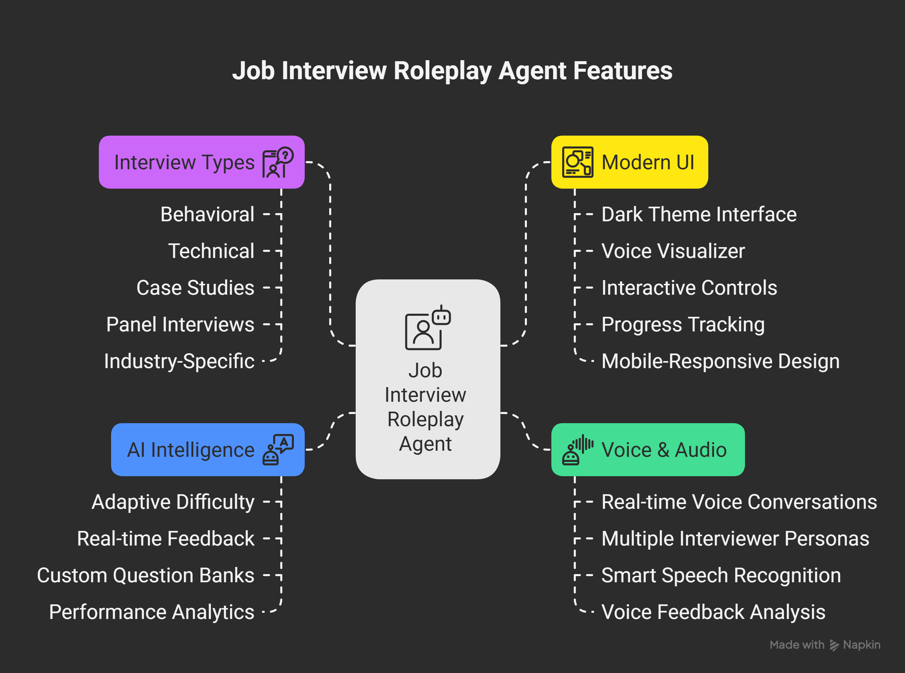
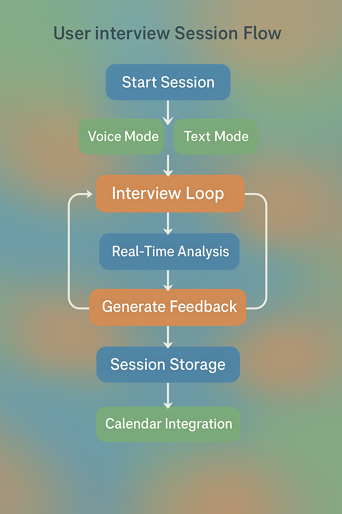
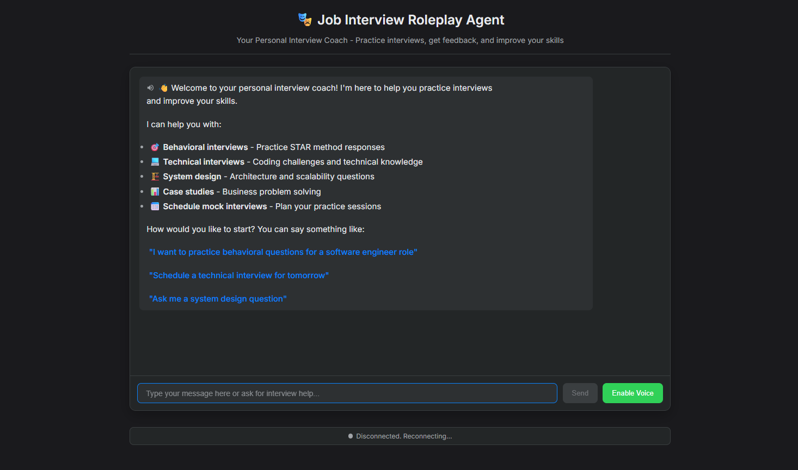

# Job Interview Roleplay Agent 🎯

AI-powered interview coaching platform with **natural voice conversations** and intelligent feedback. Built with Google's Agent Development Kit (ADK).

## ✨ Key Features

### 🎙️ Voice & Audio

- **Real-time Voice Conversations** with WebSocket streaming
- **Multiple Interviewer Personas** (HR, Technical Lead, CEO)
- **Smart Speech Recognition** with natural language processing
- **Voice Feedback Analysis** for tone, pace, and confidence

### 🎭 Interview Types

- **Behavioral**: STAR method coaching, leadership scenarios
- **Technical**: Live coding, algorithms, system design
- **Case Studies**: Business problems, analytical thinking
- **Panel Interviews**: Multi-interviewer scenarios
- **Industry-Specific**: Software, Data Science, Product, Finance, Healthcare

### 🎨 Modern UI

- **Dark Theme Interface** with professional design
- **Voice Visualizer** with real-time audio waveforms
- **Interactive Controls** for session management
- **Progress Tracking** with detailed analytics
- **Mobile-Responsive** design

### 🧠 AI Intelligence

- **Adaptive Difficulty** based on your responses
- **Real-time Feedback** during conversations
- **Custom Question Banks** for 50+ job roles
- **Performance Analytics** with improvement suggestions

## How It Works

The following diagram illustrates the comprehensive workflow of the Job Interview Agent:



## Session Workflow



## 🚀 Quick Start Guide

### Prerequisites

- Python 3.8 or newer
- Microphone and speakers for voice interaction
- Google account (for Calendar integration - optional)

### 1. Setup Project

```bash
# Navigate to the job interview agent directory
cd job-interview-agent

# Create virtual environment
python -m venv .venv

# Activate virtual environment
.venv\Scripts\activate          # Windows
source .venv/bin/activate       # macOS/Linux

# Install dependencies
pip install -r requirements.txt
```

### 2. Setup Gemini API Key

1. Create or use an existing [Google AI Studio](https://aistudio.google.com/) account
2. Get your Gemini API key from the [API Keys section](https://aistudio.google.com/app/apikeys)
3. Create a `.env` file in the project root:

```bash
GOOGLE_API_KEY=your_gemini_api_key_here
```

### 3. Setup Google Calendar Integration (Optional)

#### Create Google Cloud Project

1. Go to the [Google Cloud Console](https://console.cloud.google.com/)
2. Create a new project or select an existing one
3. Enable the Google Calendar API:
   - Navigate to "APIs & Services" > "Library"
   - Search for "Google Calendar API" and enable it

#### Create OAuth 2.0 Credentials

1. In Google Cloud Console, go to "APIs & Services" > "Credentials"
2. Click "Create Credentials" > "OAuth client ID"
3. Select "Desktop application" as application type
4. Name it "Job Interview Agent Calendar"
5. Download the credentials JSON file
6. Save as `credentials.json` in the project root

#### Run Calendar Setup

```bash
# Authenticate with Google Calendar
python setup_calendar_auth.py
```

This will:

- Open your browser for OAuth authorization
- Save access token securely
- Test calendar connection
- Grant access to schedule interview practice sessions

### 4. Start the Agent

```bash
# Navigate to app directory
cd app

# Start the server
python main.py

# Start hot-reloading server
uvicorn main:app --reload --host
```

### 5. Start Practicing 🎙️



Open your browser and go to: **<http://localhost:8000>**

#### Voice Mode Quick Start

Click the microphone icon and say:
> **"Hi, I'd like to practice for a software engineer interview"**

#### Calendar Integration

Try calendar commands:
> **"Schedule a practice interview for tomorrow at 3 PM"**

#### Advanced Features
>
> **"Start a technical interview with system design focus for a senior role"**

That's it! You're now ready for comprehensive voice-powered interview practice with full scheduling and analytics.

## 🎙️ Voice Interview Examples

### 🎯 Product Manager Interview

```text
You: "Hi, I'd like to practice behavioral questions for a product manager role"

Agent: "Excellent! Imagine you're leading a product that's losing market share. 
        Walk me through your approach to diagnose and fix this."

You: "First, I'd analyze our user retention metrics and competitor landscape..."

Agent: "Strong start! Can you be more specific about which metrics you'd prioritize 
        and how you'd balance short-term fixes with long-term strategy?"
```

### 💻 Technical Interview

```text
You: "I'm preparing for a senior engineer role. Can you give me a system design challenge?"

Agent: "Perfect! Let's design a real-time chat system like WhatsApp that supports 
        1 billion users. Start with the high-level architecture."

You: "I'd begin with a microservices architecture..."

Agent: "Great foundation! How would you handle message ordering across distributed systems?"
```

## 💬 Voice Commands

### Session Control

- **"Start voice mode"** - Enable real-time conversation
- **"Switch to text mode"** - Change to keyboard interaction
- **"Make this more challenging"** - Increase difficulty mid-session
- **"End session and provide feedback"** - Complete with analysis

### Interview Types

- **"Start a behavioral interview for [role]"** - Begin specific session
- **"Practice system design for 30 minutes"** - Focused practice
- **"Simulate a panel interview"** - Multi-person scenarios

## ⚙️ Comprehensive Configuration

### 🎯 Custom Question Banks

#### Industry-Specific Libraries

```json
{
  "technology": {
    "software_engineering": {
      "behavioral": [
        {
          "question": "Describe a time when you had to refactor legacy code under tight deadlines",
          "expected_duration": "5-7 minutes"
        }
      ],
      "technical": [
        {
          "question": "Design a URL shortener like bit.ly",
          "tools_required": ["whiteboard", "coding"]
        }
      ]
    }
  }
}
```

#### Adaptive Difficulty Scaling

```json
{
  "difficulty_progression": {
    "beginner": {
      "question_complexity": "basic_scenarios",
      "technical_depth": "fundamental_concepts",
      "time_pressure": "relaxed",
      "follow_up_intensity": "supportive"
    },
    "intermediate": {
      "question_complexity": "real_world_scenarios",
      "technical_depth": "applied_knowledge",
      "time_pressure": "moderate",
      "follow_up_intensity": "challenging"
    },
    "expert": {
      "question_complexity": "ambiguous_problems",
      "technical_depth": "architecture_level",
      "time_pressure": "realistic",
      "follow_up_intensity": "stress_testing"
    }
  }
}
```

### 📊 Advanced Scoring Configuration

#### Multi-dimensional Assessment

```json
{
  "scoring_framework": {
    "technical_skills": {
      "weight": 40,
      "criteria": ["correctness", "efficiency", "scalability", "best_practices"],
      "scoring_method": "rubric_based"
    },
    "communication": {
      "weight": 30,
      "criteria": ["clarity", "structure", "engagement", "listening"],
      "scoring_method": "ai_voice_analysis"
    },
    "problem_solving": {
      "weight": 20,
      "criteria": ["approach", "creativity", "edge_cases", "trade_offs"],
      "scoring_method": "process_evaluation"
    },
    "cultural_fit": {
      "weight": 10,
      "scoring_method": "behavioral_analysis"
    }
  }
}
```

#### Company-Specific Rubrics

```json
{
  "company_profiles": {
    "faang": {
      "emphasis": "technical_excellence",
      "behavioral_focus": "leadership_principles"
    },
    "startup": {
      "emphasis": "adaptability",
      "behavioral_focus": "ownership_resourcefulness"
    },
    "enterprise": {
      "emphasis": "reliability",
      "behavioral_focus": "stakeholder_management"
    }
  }
}
```

```

## 🚀 Advanced Features

### 🤖 AI-Powered Capabilities

#### Intelligent Persona Switching

- **Dynamic Role Adaptation**: Seamlessly switch between different interviewer types during sessions
- **Personality Consistency**: Maintain realistic interviewer characteristics throughout interactions
- **Cultural Sensitivity**: Adapt communication style based on cultural and regional preferences
- **Experience-Level Matching**: Automatically adjust interviewer seniority based on candidate level

#### Advanced Natural Language Processing

- **Intent Recognition**: Understand complex, multi-part questions and responses
- **Context Preservation**: Maintain conversation context across long interviews
- **Emotion Detection**: Identify stress, confidence, and engagement levels through voice analysis
- **Real-time Transcription**: Accurate speech-to-text with technical terminology support

### 🎨 Multi-Modal Interface Features

#### Visual Collaboration Tools

- **Virtual Whiteboard**: Real-time drawing and diagramming for system design interviews
- **Code Editor Integration**: Live coding environment with syntax highlighting and execution
- **Screen Sharing Simulation**: Practice presenting slides, portfolios, and technical demonstrations
- **Interactive Charts**: Dynamic data visualization for case study discussions

#### Accessibility & Inclusivity

- **Multiple Language Support**: Conduct interviews in 15+ languages with native-level AI
- **Hearing Impaired Support**: Real-time captions and visual feedback systems
- **Voice Modification**: Adjust speaking pace, accent, and vocal characteristics
- **Keyboard Navigation**: Complete interface accessibility for mobility-impaired users

### 📈 Enterprise & Team Features

#### Multi-User Collaboration

- **Team Practice Sessions**: Group interview preparation with peer feedback

## Docker Deployment

```bash
docker build -t job-interview-agent .
docker run -it --env-file .env job-interview-agent
```

## Troubleshooting

**Voice Issues**: Check microphone permissions, use quiet environment
**Calendar Errors**: Delete `~/.credentials/calendar_token.json` and re-run setup
**API Quota**: Monitor usage in Google Cloud Console
**Connection Issues**: Ensure port 8000 is available, try `localhost:8000`

## Support

- [ADK Documentation](https://google.github.io/adk-docs/)
- [Report Issues](https://github.com/awesome-adk-agents/issues)

---

**Practice makes perfect! Start your voice interview now at `localhost:8000`**
